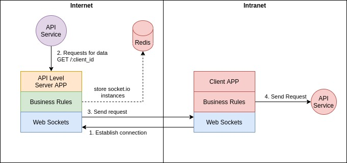

# Secure Gateway - Server

This is a proof of concept project in which the main idea is to enable server communication with WebSockets, especially [Socket.io](https://socket.io/). The server contains a simple express server with the following routes:

- GET `/clients` : returns an array of connected clients (`socket_id` and `client_id`)
- GET `/:client_id` : returns an object from [Chuck Norris API (random)](https://api.chucknorris.io/) executed in the client machine.

To connect into the Socket Server you need to specify the correct authentication token (`AUTH_TOKEN`), which you need to inform into a `.env` file. Any wrong credentials, your client won't establish communication.

With this proof of concept, I'm indicating that your client (resided in On-Premise infrastructure) could establish communication into a Cloud Application and the server can make requests through the On-Premise Application.

Redis is not implemented into this proof of concept, however, it's a future idea.

## Requirements

- The Intranet client machine must have internet
- The Intranet client machine must have the right firewall policies to communicate and receive data from the Server
- The Intranet client application should start application automatically after the machine restarts

## How to start the Server

1. Clone this repository
2. install all dependencies with `npm install`
3. Create a file called  `.env` and put the `AUTH_TOKEN` value, take the `.env-sample` as an example
4. Execute the server with `npm start` and configure your client application